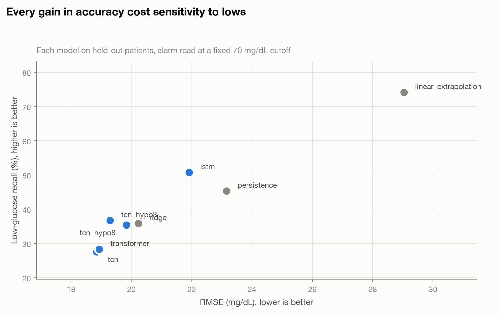
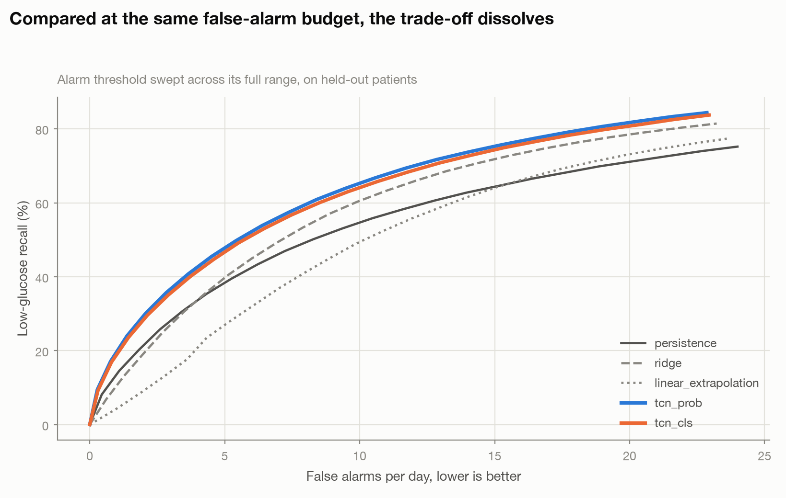
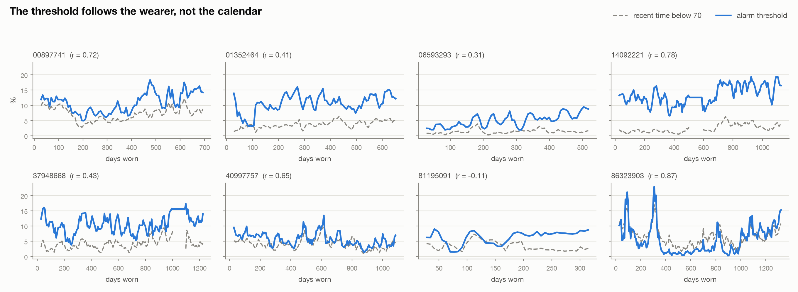

# GlucoGuard

**Predicting low blood sugar 30 minutes before it happens.**

A continuous glucose monitor tells someone with type 1 diabetes what their blood
sugar is *now*. By the time it alarms, the low has already started — and if it
starts at 3 a.m., the alarm is competing with sleep. GlucoGuard reads the last
two hours of CGM history and forecasts where glucose will be half an hour from
now, so a low can be seen coming instead of reacted to.

Trained on 40 people and **28,281 patient-days** of real CGM data from the
[OpenAPS Data Commons](https://openaps.org/outcomes/data-commons/), and
evaluated on eight people the model never saw during training.

```bash
pip install -r requirements.txt
python -m src.data.build_dataset     # raw archive -> tidy parquet
python -m scripts.run_sweep          # baselines + 3 architectures + ensemble
streamlit run app.py                 # the demo
```

---

## What it does

Given 24 CGM samples (two hours, five minutes apart), predict the glucose value
30 minutes after the last one. The output feeds a single clinical decision:
**is this person heading below 70 mg/dL?**

It does **not** recommend insulin doses. See [Limitations](#limitations).

---

## Results

Full numbers are in [`results.md`](results.md); the alarm comparison is in
[`alarm.md`](alarm.md).

A dilated convolutional network cuts RMSE from persistence's 23.2 mg/dL to
18.9 on held-out patients. But the headline result is the one we did not expect:



**Rank the models by accuracy and you almost exactly reverse their ranking by
low-glucose recall.** The most accurate model is the least willing to call a low.

This is what squared error does. It rewards a forecast that stays near the
conditional mean, and hypoglycaemia lives in the tail — so a model that hedges
toward the middle wins on RMSE precisely by refusing to commit to the events the
product exists to catch. Selecting on RMSE would have shipped the worst
available alarm.

Two things follow. First, recall at a fixed 70 mg/dL cutoff compares the models'
*biases*, not their skill: the high-recall models are not more insightful, they
simply alarm more often (linear extrapolation reaches 74% recall by alarming
roughly 21 times a day, which nobody would wear). Second, the fix belongs in the
objective, not the threshold.

So each model emits a **risk score** instead, and the cutoff on that score is
tuned on validation to a false-alarm budget, then applied unchanged to test.
Compared that way, the ranking inverts:



Read at a matched **achieved** false-alarm rate — not at the budget a threshold
was tuned for, which is a different and much lower number:

| low-glucose recall | at 3 FA/day | at 8 FA/day | at 15 FA/day |
|---|---:|---:|---:|
| **tcn_prob** (predicts a distribution, alarms on P(glucose < 70)) | 36.7% | **59.5%** | **75.3%** |
| tcn_cls (head trained directly on the low/not-low label) | 35.6% | 58.4% | 74.3% |
| tcn_hypo3 (loss upweighted toward lows) | 36.4% | 59.3% | 74.2% |
| tcn (plain, best RMSE) | 36.9% | 58.1% | 71.9% |
| ridge | 27.1% | 53.7% | 71.8% |
| persistence | 28.1% | 49.3% | 64.3% |
| linear_extrapolation | 14.4% | 41.2% | 64.0% |

Linear extrapolation goes from apparently best to last. And the model that ships
— `tcn_prob` — catches **five more points of recall than the plain network at
identical accuracy and an identical false-alarm budget**, purely by asking "what
is the probability of going low" instead of "did my one guessed number land
under 70". Same architecture, same 18.9 mg/dL RMSE; only the decision layer
changed.

Full numbers for every model and budget are in [`alarm.md`](alarm.md). Which
model ships was decided on validation patients only — split into two folds, a
threshold tuned on one and scored on the other — because the top three sit
within 1.6 points of each other, and picking among near-ties by reading the test
set turns noise into a decision.

## Does it hold on people who are not like the training set?

Held-out patients answer *does this work on a new person*. They do not answer
*does this work on a different kind of person*: every split above comes from one
corner of the archive — Nightscout exports, overwhelmingly Dexcom.

So the archive's other half became a separate set: **33 patients, 3.9 million
windows** of AndroidAPS exports, a different app with a mix of Dexcom, Medtronic
and Abbott Libre sensors, mostly European. None of it was read when the training
data was assembled. Four donors had uploaded under both formats — one a test
patient, three training patients — and are excluded; without that check this
would have been a re-test on people the model already knew.

The shipped model was applied unchanged, thresholds and all:

| | original test | external population |
|---|---:|---:|
| RMSE | 18.86 | 19.95 |
| RMSE vs persistence | −19% | −16% |
| Clarke A+B | 96.3% | 97.3% |
| recall at 8 FA/day | 59.5% | 63.4% |
| recall at 15 FA/day | 75.3% | 77.9% |
| persistence at 15 FA/day | 64.3% | 65.3% |

**The ranking survives and the calibration does not.** At every matched
false-alarm rate the model still beats persistence, by 9 to 13 points — and the
external numbers are, if anything, slightly better than the test ones. But the
threshold itself does not transfer at all: a cutoff tuned for six false alarms a
day delivers 14.7 on the test patients and 10.5 here, the same failure that
appeared going from validation to test, in the other direction.

Two independent population shifts broke the threshold and neither broke the
ordering. Details, including what got worse, are in [`EXTERNAL.md`](EXTERNAL.md).

## So the threshold belongs to the wearer, not the model

If no single cutoff works for everyone, stop looking for one. Hold out each
person's **first two weeks**, fit their cutoff on that, and use it thereafter — a
CGM is worn continuously, so that data costs nothing but the beginning of
wearing the device. Both strategies are scored on identical windows, everything
after the warm-up.

| | shared cutoff | per-wearer (14 days) |
|---|---:|---:|
| false alarms/day, median | 14.7 | 5.9 |
| range across the 8 test wearers | 8.4 – 18.3 | 4.0 – 16.9 |
| wearers within 2× of the 6/day target | 25% | **88%** |
| same, external cohort, 28-day warm-up | 58% | **91%** |

**It costs about five points of pooled recall**, measured at the same achieved
false-alarm rate — and that price is the interesting part. A single global
threshold earns its pooled score partly by treating people unequally: wearers
who go low often alarm constantly, which is cheap true positives, while wearers
who rarely go low get almost no warnings. Pooling hides that and rewards it.
Equalising gives some back. What it buys is that the number on the dial is true
for the person reading it. Full tables in [`CALIBRATION.md`](CALIBRATION.md).

**And it lasts.** A threshold fitted on a fortnight and then left alone for years
had every reason to rot, so the plan was to measure how fast and schedule
recalibration around it. Splitting the evaluation period by time since
calibration, the requested six false alarms a day is delivered as 6.5 in weeks
3–4 and 6.2 past the two-year mark, never leaving 5.6–6.5 in between; the
external cohort holds 4.6–6.4 across 10,000 wearer-days. Its slow decline tracks
those wearers going low less often over the same period, which is an alarm
behaving correctly rather than decaying. [`DRIFT.md`](DRIFT.md) has the table and
the three reasons not to over-read it.

## Counting alarms the way a wearer counts them

Every number above treats each five-minute reading as its own alarm
opportunity. A device does not work that way and neither does a person. Under
per-reading accounting, half an hour of nuisance alarming is six false alarms,
and one low the model catches slightly late is several misses and several hits
at once.

So: an alarm fires and then stays quiet for 30 minutes. A **low episode** counts
as warned if the device made a sound in the hour before glucose crossed 70. An
alarm event is false only if no low followed it — alarms during an ongoing low
are not false, the wearer is low and the device is right to be noisy. And a
single alarm sitting between two nearby lows can only be credited to one of
them.

| policy (test cohort) | low episodes warned | false alarms/day | median warning |
|---|---:|---:|---:|
| one shared threshold | 90.2% | 9.3 | 35 min |
| fitted once, at two weeks | 76.3% | 5.5 | 25 min |
| **re-fitted weekly on the trailing month** | **78.2%** | 5.9 | 25 min |

On the external cohort the rolling policy warns about **76.6%** of episodes at
6.0 false alarms a day, and puts **100%** of wearers within 2× of the rate they
asked for, against 68% for a shared threshold.

This is not a metric trick. The same de-duplication that raises recall strips out
most of what used to count as a false alarm, so the threshold has to be re-tuned
in event units to hit the same budget — both sides of the trade move together.
The shared threshold's apparent 90% recall is bought with nearly twice the
interruptions, and it still misses the requested rate for a third of wearers.
[`ALARM_POLICY.md`](ALARM_POLICY.md) has the full tables.

### What the threshold actually does over time



Re-fitting weekly on the trailing month, the cutoff does not settle on a number
and stay there — it tracks the wearer. Across the eight test wearers its
correlation with their own recent time below 70 runs from 0.31 to 0.87 (median
0.54), and it moves about **1 percentage point per week**: gradual drift, not
week-to-week thrashing.

The mechanism is straightforward once seen. When someone starts going low more
often, the model hands out high probabilities more often, so the bar has to rise
to keep interruptions at six a day. One wearer's threshold travels from 0.3% to
23% across three and a half years of wear. No fixed number could have served
them at both ends.

Rolling also reaches one more person. Fixing at two weeks needs 20 lows inside
that fortnight, which one test wearer and eight external ones never produce;
re-fitting only needs 15 lows in the trailing month, and that wearer gets a
personal threshold as soon as they have had enough lows to fit one — whenever
that happens to be.

## Running it against a live feed

`streamlit run live_app.py` drives the same forecast from a CGM feed rather than
a saved file. It reads either a **Nightscout** instance — the self-hosted server
this community already runs, and the software that produced the training
archive — or replays a recorded trace as if it were happening now. Alerts go to
a phone over `ntfy.sh`, which needs no account.

It refuses rather than guesses: a gap longer than 15 minutes in the last two
hours produces no forecast at all, and says why. A stale feed is reported as
stale. Still not a medical device, and it still does not compute a dose.

---

## Why the evaluation is built the way it is

Most of the engineering here went into not fooling ourselves. Three decisions
carry that weight:

**The split is by patient, never by row.** CGM samples five minutes apart are
enormously autocorrelated. Split rows at random and the model can memorise a
trace it has already seen a few steps earlier, which produces a beautiful test
score and a system that fails on the first new person it meets. Splitting whole
patients means the reported number answers the question we actually care about.
The assignment lives in [`artifacts/splits.json`](artifacts) with a fixed seed.

**Baselines come first.** At a 30-minute horizon, glucose is autocorrelated
enough that *persistence* — predicting no change at all — is already a decent
forecaster. Any paper or demo that omits it can make a mediocre model look
impressive. We also include linear extrapolation and ridge regression on the raw
window, so every neural number is read as "how much did the extra complexity
actually buy".

**Lows get their own metrics.** Readings below 70 mg/dL are about 3% of the data.
A model can post an excellent overall RMSE while being useless exactly where a
patient needs it, because the errors on lows are averaged away. So we report RMSE
restricted to lows, the recall and precision of the 30-minute low alarm, the
false-alarm rate per day, and the share of predictions in the clinically
acceptable zones of the Clarke Error Grid.

The demo goes one step further and scores **episodes** rather than readings. One
continuous stretch below 70 is one event a patient experiences; counting each of
its readings separately lets a single long low inflate the score.

---

## Data

The OpenAPS Data Commons is a 6.5 GB archive of Nightscout exports donated by
people running open-source automated insulin delivery. `build_dataset.py` reads
the CGM `entries` records straight out of the zip, keeps sensor glucose only,
clips to a physiologically plausible 20–450 mg/dL, and resamples each patient
onto a regular 5-minute grid.

| | |
|---|---|
| Patients | 40 (of 240 in the archive, ranked by data volume) |
| Readings | 8,145,010 |
| Span | 28,281 patient-days |
| Split | 26 train / 6 validation / 8 test patients |

Two filtering rules matter. Gaps of up to 15 minutes are linearly interpolated;
anything longer invalidates every window that spans it, because filling a
three-hour hole with a straight line invents data and quietly inflates the score.
And a window's prediction target must be a genuinely observed reading — never an
interpolated one.

One patient (`17161370`) holds 1.5 GB across 37 files, an order of magnitude more
than anyone else, and is excluded so a single person cannot dominate training.

---

## Models

All three networks share two design choices:

- **They predict the change, not the level.** The network outputs how far glucose
  will move and we add that to the current reading. Predicting the absolute level
  wastes capacity re-learning "the answer is near where we are now", which
  persistence gives for free.
- **They see the rate of change explicitly.** The first difference of the window
  is a second input channel. A network can derive it, but handing it over
  shortens training and mirrors what a clinician reads off a CGM trace.

| | |
|---|---|
| `persistence` | glucose in 30 min = glucose now |
| `linear_extrapolation` | fit a line to the last 30 min, extend it |
| `ridge` | ridge regression on the raw 24-sample window |
| `lstm` | 2-layer LSTM |
| `tcn` | dilated causal convolutions, 4 levels |
| `transformer` | 3-layer encoder, learned positional embedding |
| `*_hypo{n}` | same architecture, loss upweighted toward lows |
| `ensemble` | mean of the three plain architectures |

The hypo-weighted variants exist to test one question: lows are rare, so does
telling the loss function to care about them more actually buy recall, and what
does it cost in false alarms? `results.md` has the answer.

---

## Repository layout

```
src/
  config.py              all tunable constants
  metrics.py             RMSE/MAE/MARD + hypo alarm + Clarke Error Grid
  predictor.py           checkpoint loading, rolling forecast, episode analysis
  theme.py               chart palette and Plotly chrome
  train.py               training loop, early stopping, checkpointing
  data/
    build_dataset.py     zip -> parquet
    windows.py           supervised windows + patient-level split
  models/
    baselines.py         persistence, linear extrapolation, ridge
    nets.py              LSTM, TCN, Transformer
scripts/
  run_sweep.py           runs everything, writes results.md
app.py                   Streamlit demo
```

---

## Adding insulin and carbohydrate inputs

Four variants of the same architecture, differing only in what they can see.
The result is a compressed version of this project's whole argument:

| inputs | test RMSE | recall at 8 FA/day | with a per-wearer threshold |
|---|---:|---:|---:|
| CGM only | 18.86 | 59.6% | 77.4% |
| + what the wearer did | 19.30 | **61.4%** | 77.6% |
| + what the loop computed | 18.86 | 59.3% | 77.4% |
| + both | 18.76 | 61.0% | 77.5% |

Treatment records make RMSE **worse** and the alarm **better**. We read the RMSE
column first and concluded the extra inputs had failed — the exact mistake this
project exists to warn about, committed on our own work, and withdrawn an hour
later after scoring them as alarms.

They are still not what ships. Once each wearer has a personal threshold the
advantage disappears (77.6% against 77.4%), and the channel is treacherous: one
wearer logs 71 boluses a day at a median of 0.20 U while another logs 0.5 a day
at 3.5 U. The first is a loop micro-dosing, the second is a person eating. The
same number in the same channel means opposite things.

---

## Limitations

- **It does not recommend insulin.** The output is a glucose forecast and a
  low-glucose warning. Nothing computes a dose.
- **It has not been tested on a person.** These are retrospective replays of
  recorded traces. No prospective trial, no in-silico closed-loop evaluation.
- **CGM only.** Insulin and carbohydrate records exist in the archive and are not
  used yet, which is why the model is weakest right after meals and corrections —
  the moments its inputs cannot see.
- **One horizon.** 30 minutes. Longer horizons are substantially harder and
  nothing here claims them.
- **No uncertainty.** The model returns a single number with no confidence
  attached, so it cannot yet say when it does not know.

---

## What's next

The limitations list is the roadmap, roughly in order:

1. **Add insulin and carbohydrate inputs.** The archive already contains them.
   This should close most of the post-meal gap.
2. **Predict a distribution, not a point.** A forecast that can express "I don't
   know" is what lets a downstream controller decide when *not* to act.
3. **Withhold predictions on bad input.** Sensor dropouts, artefacts, and traces
   unlike anything in training should produce silence rather than a confident
   wrong number.
4. **Extend to 60 minutes**, and report the horizons separately rather than
   quoting the easy one.

---

## Data use and acknowledgement

CGM traces come from the [OpenAPS Data Commons](https://openaps.org/outcomes/data-commons/),
donated by members of the #WeAreNotWaiting community for research use. The raw
archive is not redistributed in this repository. Thanks to the donors — this does
not exist without them.

## License

MIT
